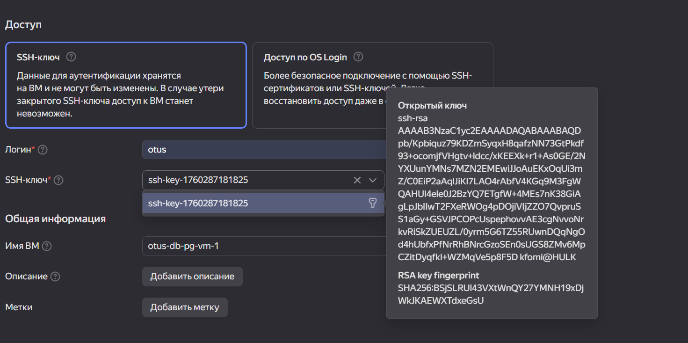
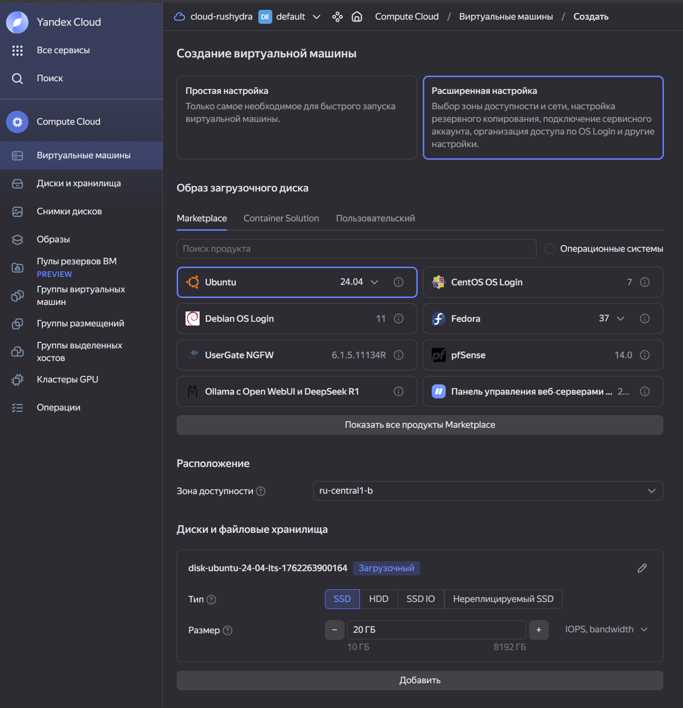
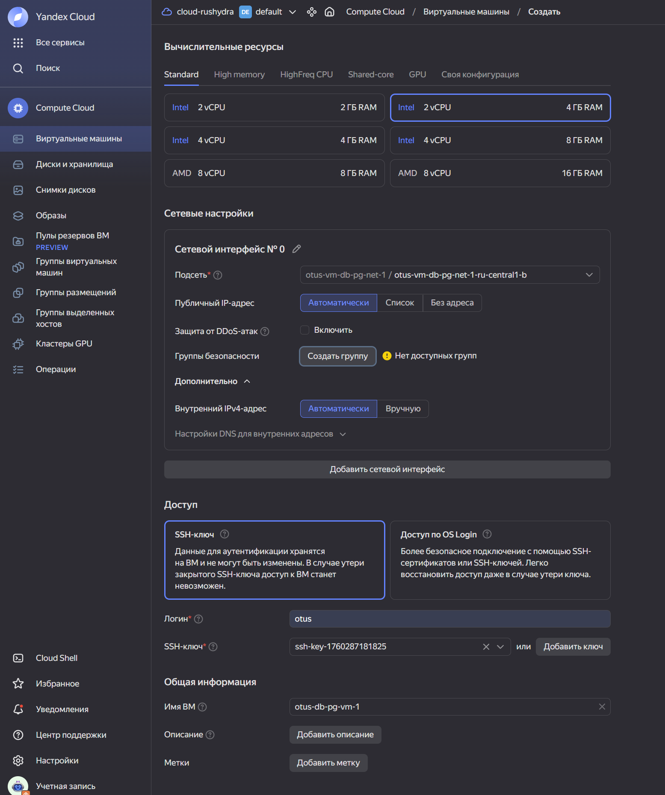
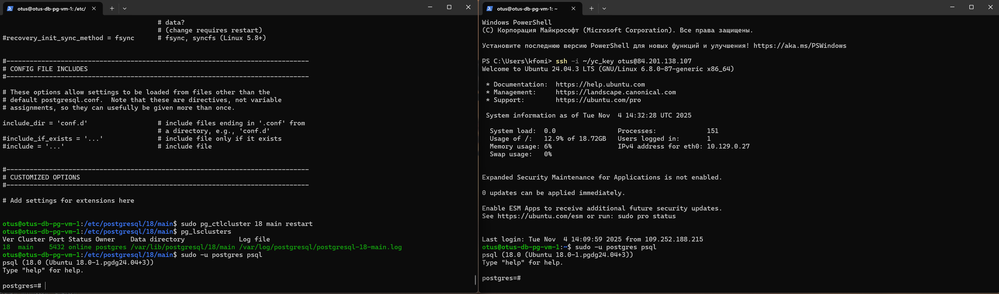

# **Домашнее задание**

### Работа с уровнями изоляции транзакции в PostgreSQL

Цель:
научиться управлять уровнем изоляции транзации в PostgreSQL и понимать особенность работы уровней read commited и repeatable read;

## Описание пошагового выполнения

### 1. Cоздать новый проект в Яндекс облако или на любых ВМ, докере

далее создать инстанс виртуальной машины с дефолтными параметрами

Создаём ВМ в Яндекс.Облако по инструкции https://cloud.yandex.ru/docs/compute/quickstart/quick-create-linux

name vm: otus-db-pg-vm-1

Сеть:
Каталог: default
Имя: otus-vm-db-pg-net-1

Сгенерировать ssh ключ:

```shell
ssh-keygen -t rsa -b 2048
name ssh-key: yc_key
chmod 600 ~/.ssh/yc_key.pub
ls -lh ~/.ssh/
cat ~/.ssh/yc_key.pub # в Windows C:\Users\<имя_пользователя>\.ssh\yc_key.pub
```

добавить свой ssh ключ в metadata ВМ


Параметры ВМ:



зайти удаленным ssh (первая сессия), не забывайте про ssh-add


```shell
PS C:\Users\kfomi> ssh -i ~/yc_key otus@84.201.138.107
The authenticity of host '84.201.138.107 (84.201.138.107)' can't be established.
ED25519 key fingerprint is SHA256:rH2D60tgkMVvLam/ZD+vATni9lDbM+YprWyA/eqKMUs.
This key is not known by any other names
Are you sure you want to continue connecting (yes/no/[fingerprint])? yes
Warning: Permanently added '84.201.138.107' (ED25519) to the list of known hosts.
Welcome to Ubuntu 24.04.3 LTS (GNU/Linux 6.8.0-87-generic x86_64)

 * Documentation:  https://help.ubuntu.com
 * Management:     https://landscape.canonical.com
 * Support:        https://ubuntu.com/pro

 System information as of Tue Nov  4 13:54:10 UTC 2025

  System load:  0.02               Processes:             135
  Usage of /:   11.2% of 18.72GB   Users logged in:       0
  Memory usage: 5%                 IPv4 address for eth0: 10.129.0.27
  Swap usage:   0%


Expanded Security Maintenance for Applications is not enabled.

0 updates can be applied immediately.

Enable ESM Apps to receive additional future security updates.
See https://ubuntu.com/esm or run: sudo pro status


The programs included with the Ubuntu system are free software;
the exact distribution terms for each program are described in the
individual files in /usr/share/doc/*/copyright.

Ubuntu comes with ABSOLUTELY NO WARRANTY, to the extent permitted by
applicable law.

otus@otus-db-pg-vm-1:~$ cat /etc/os-release
PRETTY_NAME="Ubuntu 24.04.3 LTS"
NAME="Ubuntu"
VERSION_ID="24.04"
VERSION="24.04.3 LTS (Noble Numbat)"
VERSION_CODENAME=noble
ID=ubuntu
ID_LIKE=debian
HOME_URL="https://www.ubuntu.com/"
SUPPORT_URL="https://help.ubuntu.com/"
BUG_REPORT_URL="https://bugs.launchpad.net/ubuntu/"
PRIVACY_POLICY_URL="https://www.ubuntu.com/legal/terms-and-policies/privacy-policy"
UBUNTU_CODENAME=noble
LOGO=ubuntu-logo
otus@otus-db-pg-vm-1:~$ hostname
otus-db-pg-vm-1
otus@otus-db-pg-vm-1:~$ whoami
otus
```


### 2. Поставить PostgreSQL

- Обновляем список доступных пакетов и их версий из репозиториев, все установленные пакеты до последних версий.
- Добавляем официальный репозиторий PostgreSQL в источники пакетов
- Скачиваем и добавляем ключ безопасности репозитория PostgreSQL
- Устанавливаем PostgreSQL и все зависимости
- Устанавливаем утилиту unzip для работы с архивами
- Устанавливаем Midnight Commander 

```shell
sudo apt update && \
sudo apt upgrade -y && \
sudo sh -c 'echo "deb http://apt.postgresql.org/pub/repos/apt $(lsb_release -cs)-pgdg main" > /etc/apt/sources.list.d/pgdg.list' && \
wget --quiet -O - https://www.postgresql.org/media/keys/ACCC4CF8.asc | sudo apt-key add - && \
sudo apt-get update && \
sudo apt-get -y install postgresql && \
sudo apt install unzip && \
sudo apt -y install mc
```

Смотрим список кластеров в системе:

```shell
otus@otus-db-pg-vm-1:~$ pg_lsclusters
Ver Cluster Port Status Owner    Data directory              Log file
18  main    5432 online postgres /var/lib/postgresql/18/main /var/log/postgresql/postgresql-18-main.log
```

Устанавливаем пароль для пользователя postgres:

```shell
otus@otus-db-pg-vm-1:~$ sudo -u postgres psql
psql (18.0 (Ubuntu 18.0-1.pgdg24.04+3))
Type "help" for help.

postgres=# \password
Enter new password for user "postgres":
Enter it again:
postgres=# \q
```

Открываем возможность внешних подключений:

```shell
cd /etc/postgresql/18/main/
sudo nano /etc/postgresql/18/main/postgresql.conf
#listen_addresses = 'localhost'
listen_addresses = '*'
```

Разрешаем подключение с любого адреса:

```shell
sudo nano /etc/postgresql/18/main/pg_hba.conf
#host    all             all             127.0.0.1/32            scram-sha-256 password
host    all             all             0.0.0.0/0               scram-sha-256 
```

Рестарт кластера:

```shell
otus@otus-db-pg-vm-1:/etc/postgresql/18/main$ sudo pg_ctlcluster 18 main restart
otus@otus-db-pg-vm-1:/etc/postgresql/18/main$ pg_lsclusters
Ver Cluster Port Status Owner    Data directory              Log file
18  main    5432 online postgres /var/lib/postgresql/18/main /var/log/postgresql/postgresql-18-main.log
```

### 3. Зайти вторым ssh (вторая сессия)

```shell
ssh -i ~/yc_key otus@84.201.138.107
sudo -u postgres psql
```


запустить везде psql из под пользователя postgres


выключить auto commit

```shell
postgres=#  \echo :AUTOCOMMIT
on
postgres=#  \set AUTOCOMMIT OFF
postgres=#  \echo :AUTOCOMMIT
OFF
```

### 4. Cделать

в первой сессии новую таблицу и наполнить ее данными:

```shell
postgres=# create table persons(id serial, first_name text, second_name text);
CREATE TABLE
postgres=*# insert into persons(first_name, second_name) values('ivan', 'ivanov');
INSERT 0 1
postgres=*# insert into persons(first_name, second_name) values('petr', 'petrov');
INSERT 0 1
postgres=*# commit;
COMMIT
```

посмотреть текущий уровень изоляции:

```shell
postgres=# show transaction isolation level;
 transaction_isolation
-----------------------
 read committed
(1 row)
```

начать новую транзакцию в обоих сессиях с дефолтным (не меняя) уровнем изоляции
в первой сессии добавить новую запись insert into persons(first_name, second_name) values('sergey', 'sergeev');

```shell
#Первая сессия
postgres=*# begin;
WARNING:  there is already a transaction in progress
BEGIN
postgres=*# insert into persons(first_name, second_name) values('sergey', 'sergeev');
INSERT 0 1
postgres=*#
```

```shell
#Вторая сессия
postgres=*# begin;
WARNING:  there is already a transaction in progress
BEGIN
postgres=*#
```

сделать select from persons во второй сессии

```shell
#Вторая сессия
postgres=# select * from persons;
 id | first_name | second_name
----+------------+-------------
  1 | ivan       | ivanov
  2 | petr       | petrov
(2 rows)
```

видите ли вы новую запись и если да то почему?

Новая запись не видна во второй сессии, т.к. транзакция на вставку не завершена в первой сессии.

завершить первую транзакцию - commit;
```shell
#Первая сессия
postgres=*# commit;
COMMIT
```

сделать select from persons во второй сессии
```shell
#Вторая сессия
postgres=*# select * from persons;
 id | first_name | second_name
----+------------+-------------
  1 | ivan       | ivanov
  2 | petr       | petrov
  3 | sergey     | sergeev
(3 rows)
```

видите ли вы новую запись и если да то почему?

Новая запись отображается во второй сессии, т.к. транзакция на вставку завершена в первой сессии.

завершите транзакцию во второй сессии
```shell
#Вторая сессия
postgres=*# commit;
COMMIT
```
начать новые но уже repeatable read транзакции - set transaction isolation level repeatable read;
```shell
#Первая сессия
postgres=# set transaction isolation level repeatable read;
SET
postgres=*# begin;
WARNING:  there is already a transaction in progress
BEGIN
```

```shell
#Вторая сессия
postgres=# set transaction isolation level repeatable read;
SET
postgres=*# begin;
WARNING:  there is already a transaction in progress
BEGIN
```

в первой сессии добавить новую запись insert into persons(first_name, second_name) values('sveta', 'svetova');

```shell
#Первая сессия
postgres=*# insert into persons(first_name, second_name) values('sveta', 'svetova');
INSERT 0 1
```

сделать select* from persons во второй сессии*
```shell
#Вторая сессия
postgres=*# select * from persons;
 id | first_name | second_name
----+------------+-------------
  1 | ivan       | ivanov
  2 | petr       | petrov
  3 | sergey     | sergeev
(3 rows)
```

видите ли вы новую запись и если да то почему?

Нет, новой записи не видно, т.к. не выполнено завершение транзакции в первой сессии.

завершить первую транзакцию - commit;
```shell
#Первая сессия
postgres=*# commit;
COMMIT
```

сделать select from persons во второй сессии

```shell
#Вторая сессия
postgres=*# select * from persons;
 id | first_name | second_name
----+------------+-------------
  1 | ivan       | ivanov
  2 | petr       | petrov
  3 | sergey     | sergeev
(3 rows)
```

видите ли вы новую запись и если да то почему?

Нет, новой записи не видно, т.к. в режиме Repeatable Read видны только те данные, которые были зафиксированы до начала транзакции, и не видны не зафиксированные данные и изменения, произведённые другими транзакциями в процессе выполнения данной транзакции.

завершить вторую транзакцию
```shell
#Вторая сессия
postgres=*# commit;
COMMIT
```

сделать select * from persons во второй сессии
```shell
#Вторая сессия
postgres=# select * from persons;
 id | first_name | second_name
----+------------+-------------
  1 | ivan       | ivanov
  2 | petr       | petrov
  3 | sergey     | sergeev
  5 | sveta      | svetova
(4 rows)
```

видите ли вы новую запись и если да то почему?

Да, новая запись видна, т.к. запрос запущен запущен во второй сессии после коммита внесенных изменений в первой сессии.