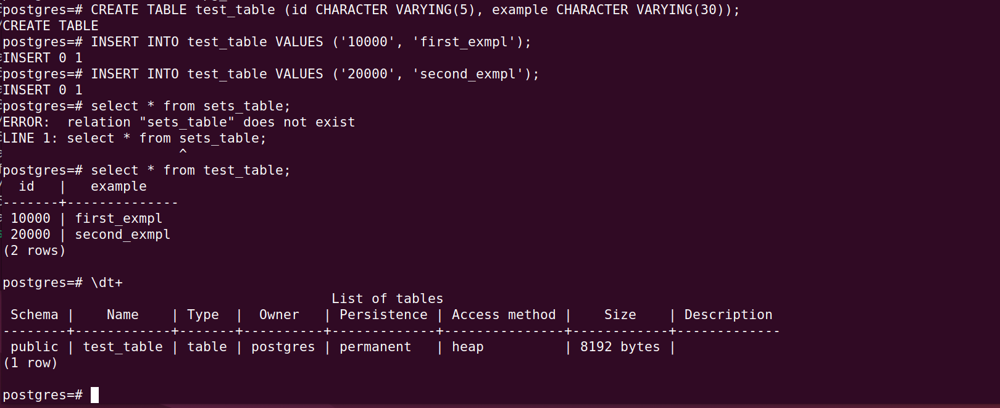
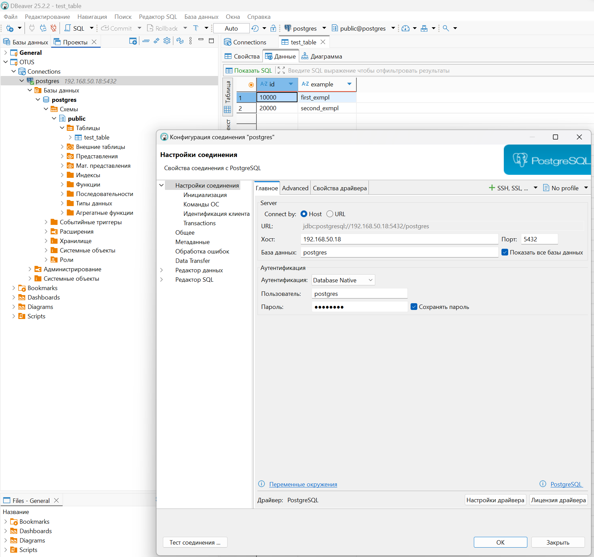
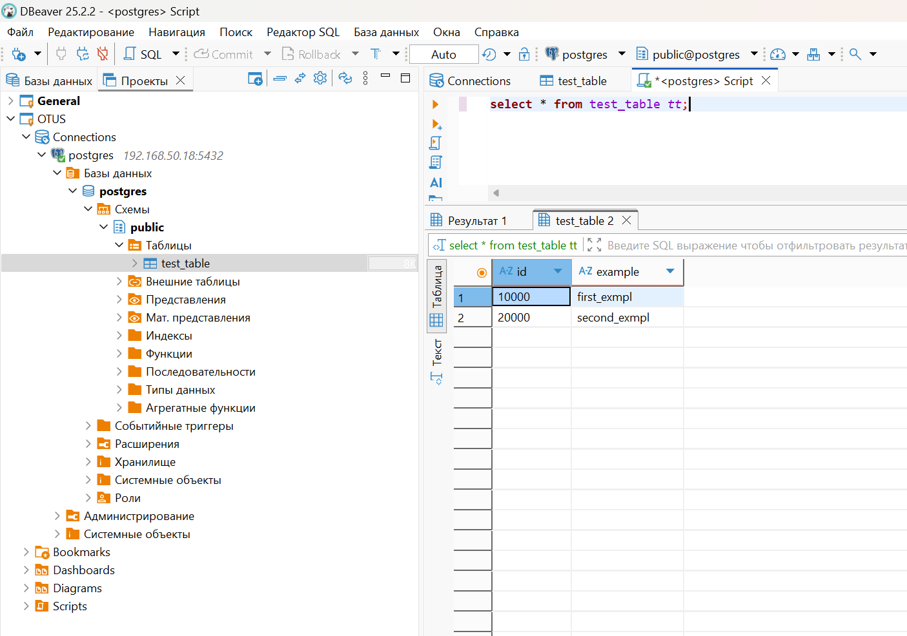

# **Домашнее задание**

### Установка и настройка PostgteSQL в контейнере Docker

Цель:
- установить PostgreSQL в Docker контейнере
- настроить контейнер для внешнего подключения

## Описание пошагового выполнения

### 1. Cоздать ВМ с Ubuntu 20.04/22.04 или развернуть докер любым удобным способом

```bash
root@student-VirtualBox:~# cat /etc/os-release
PRETTY_NAME="Ubuntu 24.04.3 LTS"
NAME="Ubuntu"
VERSION_ID="24.04"
VERSION="24.04.3 LTS (Noble Numbat)"
VERSION_CODENAME=noble
ID=ubuntu
ID_LIKE=debian
HOME_URL="https://www.ubuntu.com/"
SUPPORT_URL="https://help.ubuntu.com/"
BUG_REPORT_URL="https://bugs.launchpad.net/ubuntu/"
PRIVACY_POLICY_URL="https://www.ubuntu.com/legal/terms-and-policies/privacy-policy"
UBUNTU_CODENAME=noble
LOGO=ubuntu-logo
```

Разворачиваем докер по мануалу https://docs.docker.com/engine/install/ubuntu/

Последовательно выполняем команды:
```shell
student@student-VirtualBox:~$ sudo apt-get update
student@student-VirtualBox:~$ sudo apt-get install ca-certificates curl
student@student-VirtualBox:~$ sudo install -m 0755 -d /etc/apt/keyrings
student@student-VirtualBox:~$ sudo curl -fsSL https://download.docker.com/linux/ubuntu/gpg -o /etc/apt/keyrings/docker.asc
student@student-VirtualBox:~$ sudo chmod a+r /etc/apt/keyrings/docker.asc
student@student-VirtualBox:~$ echo \
  "deb [arch=$(dpkg --print-architecture) signed-by=/etc/apt/keyrings/docker.asc] https://download.docker.com/linux/ubuntu \
  $(. /etc/os-release && echo "${UBUNTU_CODENAME:-$VERSION_CODENAME}") stable" | \
  sudo tee /etc/apt/sources.list.d/docker.list > /dev/null
student@student-VirtualBox:~$ sudo apt-get update
student@student-VirtualBox:~$ sudo apt-get install docker-ce docker-ce-cli containerd.io docker-buildx-plugin docker-compose-plugin
```

Проверяем статус докера:

```shell
student@student-VirtualBox:~$ sudo systemctl status docker
```


Проверяем работоспособность docker:

```shell
student@student-VirtualBox:~$ sudo docker run hello-world
Unable to find image 'hello-world:latest' locally
latest: Pulling from library/hello-world
17eec7bbc9d7: Pull complete 
Digest: sha256:6dc565aa630927052111f823c303948cf83670a3903ffa3849f1488ab517f891
Status: Downloaded newer image for hello-world:latest

Hello from Docker!
This message shows that your installation appears to be working correctly.
```

сделать каталог /var/lib/postgres
```shell
student@student-VirtualBox:~$ sudo mkdir /var/lib/postgres
[sudo] password for student: 
student@student-VirtualBox:~$ sudo chmod 777 /var/lib/postgres
student@student-VirtualBox:~$ cd /var/lib/postgres/
student@student-VirtualBox:/var/lib/postgres$ pwd
/var/lib/postgres
```

### 2. Развернуть контейнер с PostgreSQL 15 смонтировав в него /var/lib/postgresql

Создаём docker сеть:
```shell
student@student-VirtualBox:/var/lib/postgres$ sudo docker network create pg-net
72877cbcc5db4dac72b5d6e9d7d51ed23edd1f73bfc65d433091f86c7f746112
```

Получаем список образов из DockerHub:
```shell
student@student-VirtualBox:/var/lib/postgres$ sudo docker search postgres
NAME                       DESCRIPTION                                     STARS     OFFICIAL
postgres                   The PostgreSQL object-relational database sy…   14605     [OK]
circleci/postgres          The PostgreSQL object-relational database sy…   35        
cimg/postgres                                                              4         
elestio/postgres           Postgres, verified and packaged by Elestio      1         
kasmweb/postgres           Postgres image maintained by Kasm Technologi…   5         
ubuntu/postgres            PostgreSQL is an open source object-relation…   41        
mcp/postgres               Connect with read-only access to PostgreSQL …   29        
chainguard/postgres        Build, ship and run secure software with Cha…   1         
artifacthub/postgres                                                       0         
corpusops/postgres         https://github.com/corpusops/docker-images/     0         
geokrety/postgres          Postgres with postgis + quantile and amqp ex…   0         
cleanstart/postgres        Secure by Design, Built for Speed, Hardened …   0         
rootpublic/postgres                                                        0         
dockette/postgres          My PostgreSQL image with tunning and preinst…   1         
vulhub/postgres                                                            0         
wayofdev/postgres                                                          0         
pgrouting/postgres          Postgres Docker images with PostGIS and dep…   0         
uselagoon/postgres                                                         0         
openeuler/postgres                                                         0         
clarinpl/postgres                                                          0         
supabase/postgres          Unmodified Postgres with some useful plugins…   66        
trainlineeurope/postgres   Extended version of official Postgres https:…   0         
brimstone/postgres         postgres image with traefik-cert support        0         
blacklabelops/postgres     Postgres Image for Atlassian Applications       4         
fredboat/postgres          PostgreSQL 10.0 used in FredBoat's docker-co…   1
```

Загружаем последнюю версию postgres

```shell
student@student-VirtualBox:/var/lib/postgres$ sudo docker pull postgres
Using default tag: latest
latest: Pulling from library/postgres
38513bd72563: Pull complete 
600882e18ec8: Pull complete 
58e43dd6f022: Pull complete 
0e792559c1d6: Pull complete 
e43339a5b9c6: Pull complete 
26f20d020b0e: Pull complete 
ea420c4160d7: Pull complete 
b73bf0979e94: Pull complete 
23ed4c7c49ef: Pull complete 
ff3cd642415f: Pull complete 
61a61f9e6b82: Pull complete 
1387828da9a3: Pull complete 
04e8facb1296: Pull complete 
Digest: sha256:1ffc019dae94eca6b09a49ca67d37398951346de3c3d0cfe23d8d4ca33da83fb
Status: Downloaded newer image for postgres:latest
docker.io/library/postgres:latest
```

Проверяем образы на локальной машине:

```shell
student@student-VirtualBox:/var/lib/postgres$ sudo docker images
REPOSITORY    TAG       IMAGE ID       CREATED        SIZE
postgres      latest    a38f9f77ff88   8 days ago     456MB
hello-world   latest    1b44b5a3e06a   2 months ago   10.1kB
```

Запускаем контейнер, устанавливаем пароль, пробрасываем порт и монтируем каталог /var/lib/postgres для данных:

```shell
sudo docker run --name postgres-srv -e POSTGRES_PASSWORD=***** -d -p 5432:5432 -v /var/lib/postgres:/var/lib/postgresql/data postgres:latest
2eece5a9aef9f4a81bfc3858f1a54353ed1802432b2cd20140a004d5ae0bc859
```

Контейнер запускается и сразу останавливается:
```shell
root@student-VirtualBox:~# docker ps -a
CONTAINER ID   IMAGE             COMMAND                  CREATED         STATUS                     PORTS     NAMES
a8d340578f5b   postgres:latest   "docker-entrypoint.s…"   3 seconds ago   Exited (1) 2 seconds ago             postgres
```

Смотрим логи:
```shell
root@student-VirtualBox:~# docker logs postgres
Error: in 18+, these Docker images are configured to store database data in a
       format which is compatible with "pg_ctlcluster" (specifically, using
       major-version-specific directory names).  This better reflects how
       PostgreSQL itself works, and how upgrades are to be performed.

       See also https://github.com/docker-library/postgres/pull/1259

       Counter to that, there appears to be PostgreSQL data in:
         /var/lib/postgresql/data (unused mount/volume)

       This is usually the result of upgrading the Docker image without
       upgrading the underlying database using "pg_upgrade" (which requires both
       versions).

       The suggested container configuration for 18+ is to place a single mount
       at /var/lib/postgresql which will then place PostgreSQL data in a
       subdirectory, allowing usage of "pg_upgrade --link" without mount point
       boundary issues.

       See https://github.com/docker-library/postgres/issues/37 for a (long)
       discussion around this process, and suggestions for how to do so.
```
Похоже, в postgres18 поменялась структура хранения данных. Пробуем изменить каталог для данных:

```shell
# Остановливаем и удаляем контейнер
sudo docker rm postgres

# Создаем правильную директорию
sudo mkdir -p /var/lib/postgresql
sudo chmod 755 /var/lib/postgresql

# Запускаем с исправленным путем (заодно добавляем запуск в сети pg-net, на предыдущем шаге пропустил)
sudo docker run --name postgres-srv --network pg-net -e POSTGRES_PASSWORD=Oracle4U -d -p 5432:5432 -v /var/lib/postgresql:/var/lib/postgresql postgres:latest
```


### 3. Развернуть контейнер с клиентом postgres

```shell
sudo docker run -it --rm --network pg-net --name pg-client postgres:latest psql -h postgres-srv -U postgres
```

Проверяем, что контейнер postgres-srv запущен в сети pg-net

```shell
root@student-VirtualBox:/var/lib/postgresql# sudo docker network inspect pg-net | grep -A 10 "Containers"
        "Containers": {
            "3a995cc18cbaea37730aa7939df7353eda6ed6f83c6c8d1fd4e68d866f8b960c": {
                "Name": "postgres-srv",
                "EndpointID": "8b2d6d5179e601566a915836310c1eaa251f1622a97a2f01b7aca214858b81dd",
                "MacAddress": "52:6e:9f:ac:58:a8",
                "IPv4Address": "172.18.0.2/16",
                "IPv6Address": ""
            }
        },
        "Options": {},
        "Labels": {}
```

### 4. Подключится из контейнера с клиентом к контейнеру с сервером и сделать таблицу с парой строк

```shell
sudo docker run -it --rm --network pg-net --name pg-client postgres:latest psql -h postgres-srv -U postgres
Password for user postgres: 
psql (18.0 (Debian 18.0-1.pgdg13+3))
Type "help" for help.

postgres=# select version();
                                                      version                                                       
--------------------------------------------------------------------------------------------------------------------
 PostgreSQL 18.0 (Debian 18.0-1.pgdg13+3) on x86_64-pc-linux-gnu, compiled by gcc (Debian 14.2.0-19) 14.2.0, 64-bit
(1 row)
```

Создаём таблицу и наполняем данными в бд postgres:

```shell
postgres=# CREATE TABLE test_table (id CHARACTER VARYING(5), example CHARACTER VARYING(30));
CREATE TABLE
postgres=# INSERT INTO test_table VALUES ('10000', 'first_exmpl');
INSERT 0 1
postgres=# INSERT INTO test_table VALUES ('20000', 'second_exmpl');
INSERT 0 1
```



### 5. Подключится к контейнеру с сервером с ноутбука/компьютера извне инстансов ЯО/места установки докера

Переключаем в настройках Virtual Box для сетевого адаптера режим подключения в Bridge и перезапускаем VM.
Проверяем адрес виртуальной машины:

```shell
student@student-VirtualBox:~$ hostname -I
192.168.50.18 172.18.0.1 172.17.0.1 
```

В хостовой машине проверяем доступ к ВМ и порту 5432:
```shell
telnet 192.168.50.18 5432
```

Доступ есть. Настраиваем подключение в Dbeaver и подключаемся.



Нашли созданную таблицу с данными, все ок.

### 6. Удалить контейнер с сервером

```shell
# Смотрим запущенные контейнеры:

student@student-VirtualBox:~$ sudo docker ps
CONTAINER ID   IMAGE             COMMAND                  CREATED             STATUS          PORTS                                         NAMES
7ec858810ece   postgres:latest   "docker-entrypoint.s…"   24 minutes ago      Up 24 minutes   5432/tcp                                      pg-client
3a995cc18cba   postgres:latest   "docker-entrypoint.s…"   About an hour ago   Up 34 minutes   0.0.0.0:5432->5432/tcp, [::]:5432->5432/tcp   postgres-srv

# Останавливаем и удаляем контейнер postgres-srv
student@student-VirtualBox:~$ sudo docker stop postgres-srv
postgres-srv
student@student-VirtualBox:~$ sudo docker rm 3a995cc18cba
3a995cc18cba
student@student-VirtualBox:~$ sudo docker ps
CONTAINER ID   IMAGE             COMMAND                  CREATED          STATUS          PORTS      NAMES
7ec858810ece   postgres:latest   "docker-entrypoint.s…"   27 minutes ago   Up 27 minutes   5432/tcp   pg-client

# Создаём заново контейнер postgres-srv
student@student-VirtualBox:~$ sudo docker run --name postgres-srv --network pg-net -e POSTGRES_PASSWORD=Oracle4U -d -p 5432:5432 -v /var/lib/postgresql:/var/lib/postgresql postgres:latest
6e53a75c60cffc1115da16e12a83fe5d3d7e7ec6b052c2234b3d9648533d813c
student@student-VirtualBox:~$ sudo docker ps
CONTAINER ID   IMAGE             COMMAND                  CREATED          STATUS          PORTS                                         NAMES
6e53a75c60cf   postgres:latest   "docker-entrypoint.s…"   4 seconds ago    Up 3 seconds    0.0.0.0:5432->5432/tcp, [::]:5432->5432/tcp   postgres-srv
7ec858810ece   postgres:latest   "docker-entrypoint.s…"   30 minutes ago   Up 30 minutes   5432/tcp                                      pg-client
```
Контейнер создан с тем же именем, но с другим ID.

### 7. Подключится снова из контейнера с клиентом к контейнеру с сервером

```shell
# Из запушенной сессии в соседнем терминале пробуем выполнить селект

postgres-# select * from test_table;
FATAL:  terminating connection due to administrator command
server closed the connection unexpectedly
	This probably means the server terminated abnormally
	before or while processing the request.
The connection to the server was lost. Attempting reset: Succeeded.

# Подключение восстановилось автоматически, пробуем ещё раз выполнить селект
postgres=# select * from test_table;
  id   |   example    
-------+--------------
 10000 | first_exmpl
 20000 | second_exmpl
(2 rows)

```
Успешно подключились к контейнеру сервера из контейнера клиента. И сразу видим, что данные на месте.


### 8. Проверить, что данные остались на месте

Делаем запрос из хостовой операционной системы



Видно, что данные на месте.