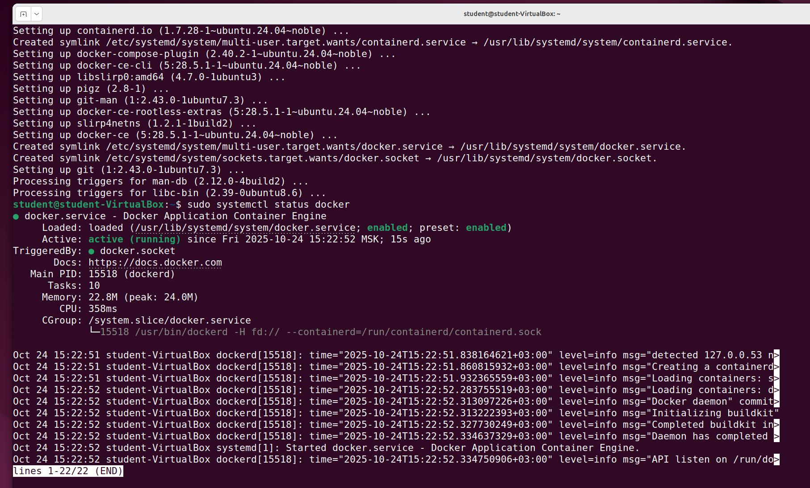

# **Домашнее задание**

### Установка и настройка PostgteSQL в контейнере Docker

Цель:
- установить PostgreSQL в Docker контейнере
- настроить контейнер для внешнего подключения

## Описание пошагового выполнения

#### Cоздать ВМ с Ubuntu 20.04/22.04 или развернуть докер любым удобным способом

```bash
root@student-VirtualBox:~# cat /etc/os-release
PRETTY_NAME="Ubuntu 24.04.3 LTS"
NAME="Ubuntu"
VERSION_ID="24.04"
VERSION="24.04.3 LTS (Noble Numbat)"
VERSION_CODENAME=noble
ID=ubuntu
ID_LIKE=debian
HOME_URL="https://www.ubuntu.com/"
SUPPORT_URL="https://help.ubuntu.com/"
BUG_REPORT_URL="https://bugs.launchpad.net/ubuntu/"
PRIVACY_POLICY_URL="https://www.ubuntu.com/legal/terms-and-policies/privacy-policy"
UBUNTU_CODENAME=noble
LOGO=ubuntu-logo
```

Разворачиваем докер по мануалу https://docs.docker.com/engine/install/ubuntu/

Последовательно выполняем команды:
```shell
student@student-VirtualBox:~$ sudo apt-get update
student@student-VirtualBox:~$ sudo apt-get install ca-certificates curl
student@student-VirtualBox:~$ sudo install -m 0755 -d /etc/apt/keyrings
student@student-VirtualBox:~$ sudo curl -fsSL https://download.docker.com/linux/ubuntu/gpg -o /etc/apt/keyrings/docker.asc
student@student-VirtualBox:~$ sudo chmod a+r /etc/apt/keyrings/docker.asc
student@student-VirtualBox:~$ echo \
  "deb [arch=$(dpkg --print-architecture) signed-by=/etc/apt/keyrings/docker.asc] https://download.docker.com/linux/ubuntu \
  $(. /etc/os-release && echo "${UBUNTU_CODENAME:-$VERSION_CODENAME}") stable" | \
  sudo tee /etc/apt/sources.list.d/docker.list > /dev/null
student@student-VirtualBox:~$ sudo apt-get update
student@student-VirtualBox:~$ sudo apt-get install docker-ce docker-ce-cli containerd.io docker-buildx-plugin docker-compose-plugin
```

Проверяем статус докера:

```shell
student@student-VirtualBox:~$ sudo systemctl status docker
```



Проверяем работоспособность docker:

```shell
student@student-VirtualBox:~$ sudo docker run hello-world
Unable to find image 'hello-world:latest' locally
latest: Pulling from library/hello-world
17eec7bbc9d7: Pull complete 
Digest: sha256:6dc565aa630927052111f823c303948cf83670a3903ffa3849f1488ab517f891
Status: Downloaded newer image for hello-world:latest

Hello from Docker!
This message shows that your installation appears to be working correctly.
```